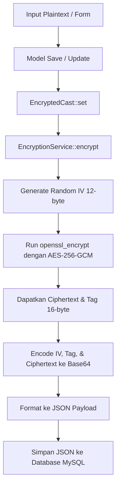
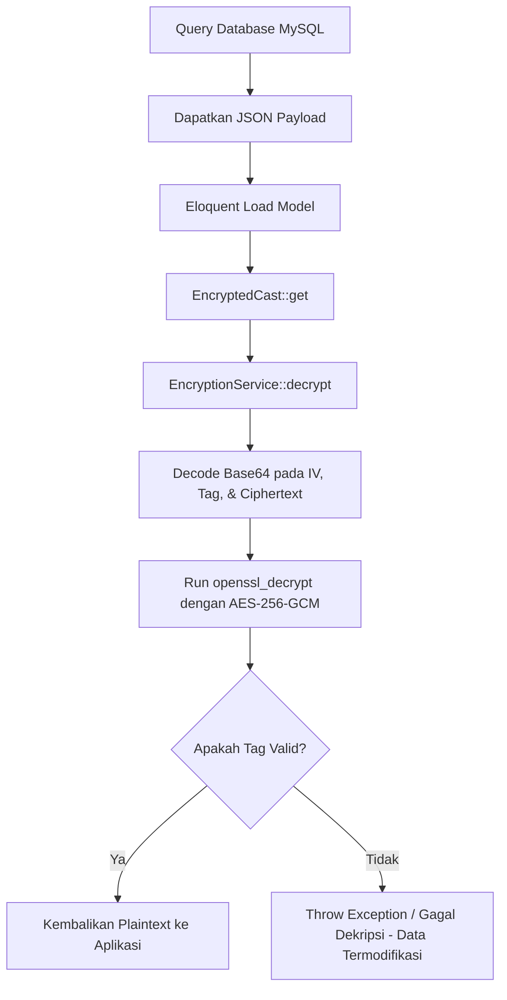

# Penjelasan Keamanan Sistem: Argon2id & AES-256-GCM

Dokumen ini menjelaskan konsep kriptografi yang digunakan dalam proyek **SIAKAD Enkripsi** (Sistem Informasi Akademik), yaitu **Argon2id** untuk pengamanan password dan **AES-256-GCM** untuk perlindungan data sensitif, serta bagaimana keduanya diimplementasikan dalam kode aplikasi.

---

## 1. Argon2id (Password Hashing)

### Apa itu Argon2id?
Argon2 adalah fungsi derivasi kunci (*key derivation function*) yang memenangkan kompetisi *Password Hashing Competition (PHC)* pada tahun 2015. Varian **Argon2id** adalah kombinasi hibrida dari Argon2i dan Argon2d:
- **Argon2d**: Sangat tahan terhadap serangan berbasis GPU/ASIC (menggunakan akses memori yang bergantung pada data), namun rentan terhadap *side-channel timing attacks*.
- **Argon2i**: Tahan terhadap *side-channel attacks* karena menggunakan akses memori yang independen dari data, namun memiliki pertahanan yang lebih lemah terhadap pengoptimalan GPU/ASIC.
- **Argon2id**: Menggabungkan keduanya. Pada fase awal (pass pertama), ia bertindak seperti Argon2i untuk mencegah *side-channel attacks*, dan pada fase berikutnya bertindak seperti Argon2d untuk mencegah serangan GPU/ASIC (*memory-hard*).

### Parameter Utama Argon2id
Keamanan Argon2id ditentukan oleh tiga parameter utama yang dikonfigurasi di aplikasi:
1. **Memory Cost (`memory`)**: Jumlah memori (dalam KB) yang harus digunakan untuk komputasi hash. Ini membatasi kemampuan penyerang yang ingin menggunakan komputasi paralel masif (GPU/ASIC) karena biaya memori yang tinggi. Pada proyek ini diatur ke **65536 KB** (64 MB).
2. **Time Cost (`time`)**: Jumlah iterasi algoritma saat menghitung hash. Semakin tinggi nilainya, semakin lama waktu komputasi yang dibutuhkan. Pada proyek ini diatur ke **4 iterasi**.
3. **Parallelism/Threads (`threads`)**: Jumlah thread CPU paralel yang digunakan untuk menghitung hash. Pada proyek ini diatur ke **1 thread**.

### Penerapan Argon2id di Proyek Ini
1. **Konfigurasi Global**:
   - Diatur di file konfigurasi Laravel [hashing.php](file:///Users/potah/Documents/webdev/enkripsi_dipa/config/hashing.php) dan [app.php](file:///Users/potah/Documents/webdev/enkripsi_dipa/config/app.php) dengan default driver `'argon2id'`.
   - Diaktifkan melalui variabel lingkungan `.env`:
     ```env
     HASH_DRIVER=argon2id
     ```
2. **Layer Model (`User`)**:
   - Model [User.php](file:///Users/potah/Documents/webdev/enkripsi_dipa/app/Models/User.php) menggunakan `password` cast `'hashed'` bawaan Laravel (yang otomatis mengacu pada driver hash terpilih di `.env`).
   - Kode sumber: [User.php:L43-48](file:///Users/potah/Documents/webdev/enkripsi_dipa/app/Models/User.php#L43-L48)
     ```php
     protected function casts(): array
     {
         return [
             'password' => 'hashed',
         ];
     }
     ```
3. **Autentikasi**:
   - Saat pengguna baru didaftarkan atau seeder dijalankan ([DatabaseSeeder.php](file:///Users/potah/Documents/webdev/enkripsi_dipa/database/seeders/DatabaseSeeder.php#L49)), password di-hash menggunakan `Hash::make('password')`.
   - Saat login di [AuthController.php](file:///Users/potah/Documents/webdev/enkripsi_dipa/app/Http/Controllers/AuthController.php), fungsi `Auth::attempt()` secara otomatis memverifikasi password ber-plaintext dengan hash Argon2id yang tersimpan di database.

---

## 2. AES-256-GCM (Symmetric Encryption)

### Apa itu AES-256-GCM?
**AES (Advanced Encryption Standard)** adalah standar enkripsi simetris yang diadopsi secara global. Angka **256** menunjukkan panjang kunci enkripsi sebesar 256-bit (32 bytes), menawarkan tingkat keamanan militer yang sangat kuat.

Varian **GCM (Galois/Counter Mode)** adalah mode operasi enkripsi yang bersifat **AEAD (Authenticated Encryption with Associated Data)**. Keunggulan GCM dibanding mode lama seperti CBC (Cipher Block Chaining) adalah:
1. **Kerahasiaan (Confidentiality)**: Mengenkripsi data menjadi ciphertext menggunakan AES.
2. **Integritas (Integrity) & Otentisitas (Authenticity)**: Menghasilkan **Authentication Tag** (16-byte) yang dikalkulasi secara kriptografis dari data asli. Jika penyerang memanipulasi bahkan satu bit ciphertext di database, proses dekripsi akan langsung gagal (*Tag Mismatch*), mencegah serangan manipulasi data (seperti *bit-flipping*).
3. **Ketahanan Terhadap Replay Attacks**: Menggunakan **Initialization Vector (IV)** atau *nonce* unik (12-byte) per proses enkripsi. Plaintext yang sama akan menghasilkan ciphertext yang sepenuhnya berbeda setiap kali dienkripsi.

### Struktur JSON Payload AES-256-GCM
Setiap kolom database yang dienkripsi disimpan dalam format JSON terenkripsi berikut:
```json
{
  "iv": "Base64-encoded Initialization Vector (12 bytes)",
  "tag": "Base64-encoded Authentication Tag (16 bytes)",
  "data": "Base64-encoded Ciphertext"
}
```

### Penerapan AES-256-GCM di Proyek Ini
Penerapan AES-256-GCM dalam proyek ini berjalan secara transparan dan terisolasi dengan baik:

1. **Kunci Enkripsi (`AES_ENCRYPTION_KEY`)**:
   - Disimpan di file `.env` sebagai `AES_ENCRYPTION_KEY` (berupa base64-encoded string sepanjang 32-byte).
   - Diambil via konfigurasi `config('app.aes_encryption_key')` di [app.php](file:///Users/potah/Documents/webdev/enkripsi_dipa/config/app.php#L119).
   
2. **Service Utama (`EncryptionService`)**:
   - Terletak di [EncryptionService.php](file:///Users/potah/Documents/webdev/enkripsi_dipa/app/Services/EncryptionService.php).
   - Menggunakan pustaka OpenSSL PHP (`openssl_encrypt` dan `openssl_decrypt`) dengan parameter `aes-256-gcm`, panjang IV 12 byte, dan panjang tag 16 byte.
   - Didaftarkan sebagai **Singleton** di [AppServiceProvider.php](file:///Users/potah/Documents/webdev/enkripsi_dipa/app/Providers/AppServiceProvider.php#L18-L21) agar proses inisialisasi kunci hanya berjalan sekali.

3. **Otomatisasi Database (`EncryptedCast`)**:
   - Terletak di [EncryptedCast.php](file:///Users/potah/Documents/webdev/enkripsi_dipa/app/Casts/EncryptedCast.php).
   - Mengimplementasikan interface Eloquent `CastsAttributes`.
   - Mengenkripsi secara otomatis data mentah saat melakukan operasi penulisan ke database (`set`), dan mendekripsi kembali menjadi teks asli saat dibaca (`get`).

4. **Model yang Dilindungi**:
   - **`Mahasiswa`** ([Mahasiswa.php](file:///Users/potah/Documents/webdev/enkripsi_dipa/app/Models/Mahasiswa.php#L49-L55)):
     Melindungi data PII (Personally Identifiable Information): `nama`, `email`, `alamat`, dan `nomor_telepon`.
   - **`Nilai`** ([Nilai.php](file:///Users/potah/Documents/webdev/enkripsi_dipa/app/Models/Nilai.php#L40-L42)):
     Melindungi data akademik `nilai_angka` (independen terhadap kolom `grade` untuk efisiensi querying).
   - **`Ipk`** ([Ipk.php](file:///Users/potah/Documents/webdev/enkripsi_dipa/app/Models/Ipk.php#L37-L40)):
     Melindungi nilai IPK mahasiswa (`ipk`).

---

## 3. Alur Kerja Enkripsi Data (Data Lifecycle)

### A. Alur Penyimpanan Data (Write Path)


### B. Alur Pembacaan Data (Read Path)


---

## 4. Pengujian Keamanan (Security Verification)

Untuk menjamin kepatuhan metodologi penelitian dan keamanan enkripsi, proyek ini menyediakan automated tests:
1. **`tests/Feature/EncryptionTest.php`** ([EncryptionTest.php](file:///Users/potah/Documents/webdev/enkripsi_dipa/tests/Feature/EncryptionTest.php)):
   - Memastikan data tersimpan di DB sebagai JSON payload dengan kunci `iv`, `tag`, dan `data` (bukan plaintext).
   - Memastikan nilai IV selalu acak dan unik per operasi enkripsi (sehingga plaintext yang sama menghasilkan ciphertext berbeda).
   - Memastikan deteksi integritas data (mencegah *tampering*).
2. **`tests/Feature/AuthTest.php`** ([AuthTest.php](file:///Users/potah/Documents/webdev/enkripsi_dipa/tests/Feature/AuthTest.php)):
   - Memastikan flow autentikasi berbasis hashing Argon2id berjalan dengan benar.
